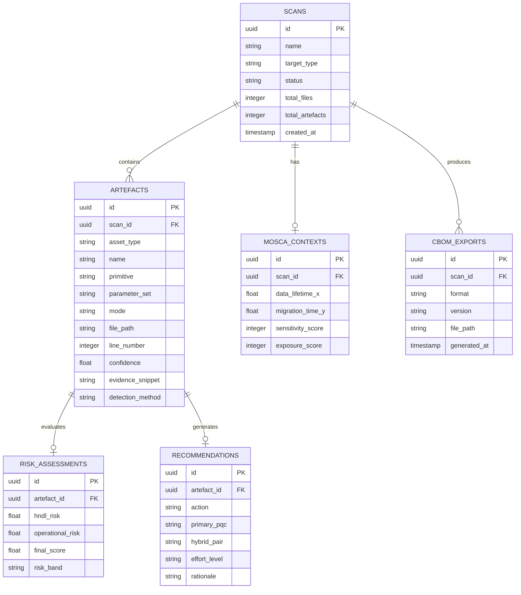

# ECDAT — System Architecture & Technical Specification

**Project:** Enterprise Cryptographic Discovery & Analysis Tool (ECDAT)  
**Problem Statement ID:** 26164 (NTRO — National Technical Research Organisation)  
**Document Version:** 1.0.0  
**Target Audience:** Software Architects, Security Engineers, Core Developers  

---

## 🏛️ 1. High-Level Architecture Overview

**ECDAT** is designed as a modular, asynchronous, microservice-ready web application that automates cryptographic discovery, quantum risk evaluation, Mosca timeline analysis, and Post-Quantum Cryptography (PQC) migration planning.

### Architectural Principles
1. **On-Premise & Air-Gap First**: Zero mandatory external API calls; all scanning, analysis, and report generation run entirely within localized container boundaries.
2. **Asynchronous & Non-Blocking**: Codebase and image scanning run in distributed background workers (Celery + Redis) with real-time status updates delivered via WebSockets.
3. **Deterministic & Explainable**: Risk scores, Mosca classifications, and PQC recommendations are calculated using audited mathematical formulas and rule taxonomies—no uninspectable black-box machine learning.
4. **Standards-Compliant (CycloneDX 1.6+ ECMA-424)**: Internal data models map bi-directionally to the official OWASP CycloneDX Cryptographic Bill of Materials (CBOM) specification.
5. **Defense-in-Depth Sandboxing**: Untrusted user uploads are sanitized, unarchived safely, and scanned inside restricted worker containers with resource caps and execution timeouts.

---

## 🧩 2. Component Topology & Container Layout

```
                                  ┌───────────────────────────────────────────────┐
                                  │            Client Web Browser                 │
                                  │   (Next.js 14 Dashboard / React / Tailwind)   │
                                  └───────────────────────┬───────────────────────┘
                                                          │ HTTP / REST / WebSockets
                                                          │ (Port 3000 -> 8000)
                                  ┌───────────────────────▼───────────────────────┐
                                  │            FastAPI Gateway Service            │
                                  │  - Auth (JWT)         - Scan Controller       │
                                  │  - REST Endpoints     - WS Handler            │
                                  │  - CBOM Serializer    - MinIO Connector       │
                                  └───────────┬───────────────────────┬───────────┘
                                              │                       │
                       ┌──────────────────────┴──────┐         ┌──────┴──────────────────────┐
                       │  PostgreSQL 16 Database     │         │      Redis 7 Message Broker │
                       │  - Scan metadata            │         │  - Celery Task Queue        │
                       │  - Normalised Artefacts     │         │  - WebSocket Pub/Sub        │
                       │  - Risk & Mosca results     │         └──────────────┬──────────────┘
                       └─────────────────────────────┘                        │
                                                                              ▼
                                                               ┌─────────────────────────────┐
                                                               │  Celery Scanner Workers     │
                                                               │  (Python 3.12 Sandbox)      │
                                                               └──────────────┬──────────────┘
                                                                              │
               ┌──────────────────────────────────────────────────────────────┼──────────────────────────────────────────────────────────────┐
               ▼                                                              ▼                                                              ▼
 ┌────────────────────────────┐                                 ┌────────────────────────────┐                                 ┌────────────────────────────┐
 │  Semgrep Static Detector   │                                 │   Syft SBOM Dependency     │                                 │  Cert & Config Parsers     │
 │  - Java, Py, JS, Go, Rust  │                                 │   - Package Manifests      │                                 │  - X.509 PEM / DER         │
 │  - API & Pattern Rules     │                                 │   - Known Crypto Libraries │                                 │  - TLS, Nginx, Java.sec    │
 └─────────────┬──────────────┘                                 └─────────────┬──────────────┘                                 └─────────────┬──────────────┘
               │                                                              │                                                              │
               └──────────────────────────────────────────────────────────────┼──────────────────────────────────────────────────────────────┘
                                                                              ▼
                                                               ┌─────────────────────────────┐
                                                               │   Normalizer & Dedup        │
                                                               └──────────────┬──────────────┘
                                                                              ▼
                                                               ┌─────────────────────────────┐
                                                               │  Risk, Mosca & PQC Engines  │
                                                               └──────────────┬──────────────┘
                                                                              ▼
                                                               ┌─────────────────────────────┐
                                                               │   MinIO S3 Object Storage   │
                                                               │  (Zips, CBOMs & PDFs)       │
                                                               └─────────────────────────────┘
```

---

## 🔄 3. End-to-End Scan Data Flow

The lifecycle of a single scan execution proceeds through 9 sequential, deterministic stages:

```
┌──────────────┐     ┌──────────────┐     ┌──────────────┐     ┌──────────────┐     ┌──────────────┐
│ 1. INGEST    │ ──> │ 2. EXTRACT   │ ──> │ 3. DETECT    │ ──> │ 4. NORMALIZE │ ──> │ 5. PERSIST   │
│ Upload zip   │     │ Safe unpack  │     │ Semgrep/Syft │     │ Deduplicate  │     │ Write to DB  │
│ to MinIO     │     │ & sanitize   │     │ cert/configs │     │ & confidence │     │ PostgreSQL   │
└──────────────┘     └──────────────┘     └──────────────┘     └──────────────┘     └──────────────┘
                                                                                           │
┌──────────────┐     ┌──────────────┐     ┌──────────────┐                                 │
│ 9. NOTIFY    │ <── │ 8. REPORT    │ <── │ 7. CBOM      │ <── ┌──────────────┐            │
│ WebSockets   │     │ PDF Summary  │     │ CycloneDX    │     │ 6. ANALYZE   │ <───────────┘
│ push status  │     │ to MinIO     │     │ 1.6+ JSON    │     │ Risk / Mosca │
└──────────────┘     └──────────────┘     └──────────────┘     │ / PQC Engine │
                                                               └──────────────┘
```

### Stage Detail
1. **Ingest**: User submits target archive via `/api/v1/scans` HTTP POST. FastAPI streams the payload into MinIO (`scans/raw/{scan_id}.zip`) and emits a Celery task `run_crypto_scan(scan_id)`.
2. **Extract**: Celery worker downloads zip from MinIO into an ephemeral sandbox directory (`/tmp/scans/{scan_id}`). Checks for zip-slip paths (`../`) and max size caps before unpacking.
3. **Detect**: Parallel execution of detector plugins:
   - `SemgrepDetector`: Runs pattern matching rules against source files.
   - `DependencyDetector`: Invokes Syft to scan lockfiles (`package.json`, `pom.xml`, etc.).
   - `CertificateDetector`: Scans for `.pem`, `.crt`, `.key` files and parses X.509 structures.
   - `ConfigDetector`: Parses web server (`nginx.conf`) and runtime policies (`java.security`).
4. **Normalize**: Merges raw detector outputs into unified `CryptoArtefact` internal objects. Calculates confidence score ($0.0 - 1.0$), redacts secret key materials in evidence snippets, and deduplicates identical findings across files.
5. **Persist**: Writes normalized findings to PostgreSQL database under `artefacts` table linked to `scan_id`.
6. **Analyze**:
   - `QuantumRiskEngine`: Computes HNDL and Operational risk scores.
   - `MoscaEngine`: Computes timeline margins ($Z - (X+Y)$) across 4 scenarios.
   - `PQCEngine`: Maps legacy algorithms to NIST FIPS 203/204/205 & RFC 10024 recommendations.
7. **CBOM Build**: `CBOMBuilder` serializes PostgreSQL database artefacts into standard CycloneDX 1.6+ JSON. Validates schema against official ECMA-424 rules.
8. **Report**: Generates executive PDF summary report using ReportLab; uploads JSON and PDF to MinIO storage.
9. **Notify**: Broadcasts completion event and summary statistics via WebSocket topic `scan:{scan_id}:progress`.

---

## 🧮 4. Analysis Engines & Mathematical Specifications

### 4.1 Quantum Risk Engine Math

Every discovered cryptographic artefact receives a composite **Final Risk Score** ($0.0 - 10.0$) derived from two primary risk sub-scores:

#### 1. Harvest Now, Decrypt Later (HNDL) Risk Score
Focuses on retroactive decryption of captured ciphertext:
$$\text{HNDL\_Risk} = \text{QV} \times \left(\frac{\text{Sensitivity}}{10}\right) \times \left(\frac{\text{Lifetime}}{10}\right) \times \left(\frac{\text{Exposure}}{10}\right) \times \alpha$$

Where:
- $\text{QV}$ = Quantum Vulnerability Rating ($0 - 10$, e.g., RSA-2048 = 10, AES-256 = 2).
- $\text{Sensitivity}$ = User-configured data sensitivity ($1 - 10$).
- $\text{Lifetime}$ = Data retention shelf life $X$ ($1 - 30$ years, normalized $/10$).
- $\text{Exposure}$ = Network exposure ($10$ for public internet, $5$ for internal network, $2$ for isolated offline).
- $\alpha$ = Algorithm factor ($1.5$ for asymmetric key exchange/RSA/ECDH, $1.0$ for others).

#### 2. Operational Risk Index
Focuses on operational vulnerability and algorithm key strength decay:
$$\text{Operational\_Risk} = \left(0.4 \cdot \text{QV} + 0.2 \cdot \text{Classical\_Weakness} + 0.2 \cdot \text{Exposure} + 0.2 \cdot \text{Criticality}\right) \times \left(1 + \frac{\text{Complexity}}{20}\right)$$

Where:
- $\text{Classical\_Weakness}$ = Score for classical flaws (e.g. SHA-1 = 8, MD5 = 10, ECB mode = 9).
- $\text{Complexity}$ = Estimated replacement complexity ($1 - 10$).

#### 3. Composite Final Risk Score
$$\text{Final\_Score} = \min\left(10.0, \, \left(0.6 \cdot \text{HNDL\_Risk} + 0.4 \cdot \text{Operational\_Risk}\right) \times \text{Confidence}\right)$$

#### 4. Risk Bands
- **Critical (≥ 7.5)**: Red badge. Immediate PQC migration required.
- **High (≥ 5.5)**: Orange badge. Migration plan mandatory within 12 months.
- **Medium (≥ 3.5)**: Yellow badge. Monitor and schedule migration.
- **Low (< 3.5)**: Green badge. Acceptable baseline risk.

---

### 4.2 Mosca’s Theorem Engine

Implements Dr. Michele Mosca’s inequality:
$$\text{IF } (X + Y) > Z \implies \text{SYSTEM IS ALREADY LATE}$$

```
Timeline Axis (Years):
0 ──────────────────── X (Data Lifetime) ────────────────────>
                      └────────── Y (Migration) ──────────>
───────────────────────────────────| Z (CRQC Arrival) ────────>
                                   ▲
                                   │ Margin = Z - (X + Y)
```

- **Inputs**:
  - $X$ = Data confidentiality shelf life (years, user-configured).
  - $Y$ = Estimated migration time (years, default 4 years).
- **Planning Scenarios ($Z$)**:
  1. **Optimistic**: $Z = 15$ years
  2. **Baseline**: $Z = 10$ years (NIST planning median)
  3. **Aggressive**: $Z = 5$ years (HNDL-focused / sensitive government data)
  4. **Regulatory**: $Z = 7$ years (NIST 2030 deprecation milestone)
- **Output Metrics**:
  - $\text{Mosca\_Margin} = Z - (X + Y)$
  - **Category Mapping**:
    - `EXPIRED` ($\text{Margin} < 0$ in Baseline scenario): Migration is overdue.
    - `URGENT` ($\text{Margin} < 0$ in Aggressive scenario OR Risk $\ge 7.5$).
    - `PLAN` ($\text{Margin} \ge 0$ but Risk $\ge 5.5$).
    - `MONITOR` ($\text{Margin} \ge 5$ and Risk $< 5.5$).

---

### 4.3 PQC Recommendation Engine

Maps discovered legacy cryptographic primitives directly to NIST August 2024 finalized standards and RFC 10024 hybrid pairings:

| Legacy Primitive | Primary PQC Standard | Hybrid Transition Pair | Action Classification |
|------------------|----------------------|------------------------|-----------------------|
| RSA Key Exchange | **ML-KEM-768** (FIPS 203) | `X25519MLKEM768` | `Hybrid Migration` |
| ECDH / X25519 | **ML-KEM-768** (FIPS 203) | `X25519MLKEM768` | `Hybrid Migration` |
| RSA Signature | **ML-DSA-65** (FIPS 204) | `RSA-3072 + ML-DSA-65` | `Hybrid Migration` |
| ECDSA Signature | **ML-DSA-65** (FIPS 204) | `ECDSA-P256 + ML-DSA-65` | `Hybrid Migration` |
| Long-term Archive Sig | **SLH-DSA** (FIPS 205) | `SLH-DSA` | `Direct Migration` |
| AES-128 Encryption | **AES-256-GCM** | — | `Direct Migration` |
| AES-256-GCM | **AES-256-GCM** | — | `Keep (Quantum Safe)` |
| SHA-256 Hashing | **SHA-256** | — | `Keep (Quantum Safe)` |
| SHA-1 / MD5 / DES | **SHA-256** / **AES-256** | — | `Immediate Replacement` |

---

## 🗄️ 5. Database ERD & Schema Specification



---

## 🔒 6. Worker Security & Execution Sandboxing

Because ECDAT processes untrusted code archives, binaries, and container layers submitted by users, the scanner subsystem enforces strict security barriers:

1. **Path Traversal & Zip-Slip Defense**: Zip contents are extracted using a custom streaming extractor that validates target canonical paths, rejecting symlinks and any path containing `../`.
2. **Container Boundary & Isolation**: Celery scan tasks execute inside non-root Docker containers (`uid=10001`).
3. **Resource Caps**: Worker containers are bounded via Docker Compose:
   - `cpus: 2.0`
   - `memory: 4GB`
   - `pids: 100`
4. **No Network Egress**: Scanner worker containers run on an isolated Docker bridge network without external internet gateways (`internal: true`).
5. **Secret Redaction**: Detected private key PEM headers, raw secret values, and authorization tokens are redacted (`[REDACTED_SECRET]`) prior to database persistence.

---

## ⚡ 7. Scalability & Performance Metrics

| Performance Target | Requirement | Architectural Provision |
|--------------------|-------------|-------------------------|
| **Scan Execution Speed** | < 5 mins for 1,000 files | Parallel Celery tasks; ignore `node_modules`, `.git`, `vendor` |
| **API Response Latency** | < 500ms for non-scan endpoints | SQLAlchemy async driver; Redis caching for summary metrics |
| **CBOM Generation** | < 2 seconds for 500 artefacts | Fast JSON serialization via Pydantic v2 rust core |
| **Concurrent Scans** | Up to 10 parallel scans | Celery distributed worker pool scaled horizontally |

---

*This architecture document serves as the authoritative blueprint for ECDAT development and integration.*
