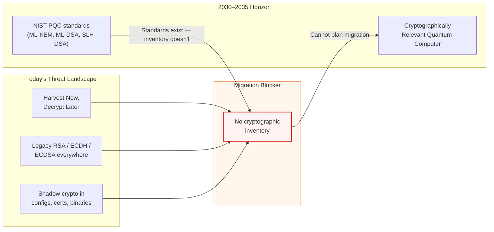
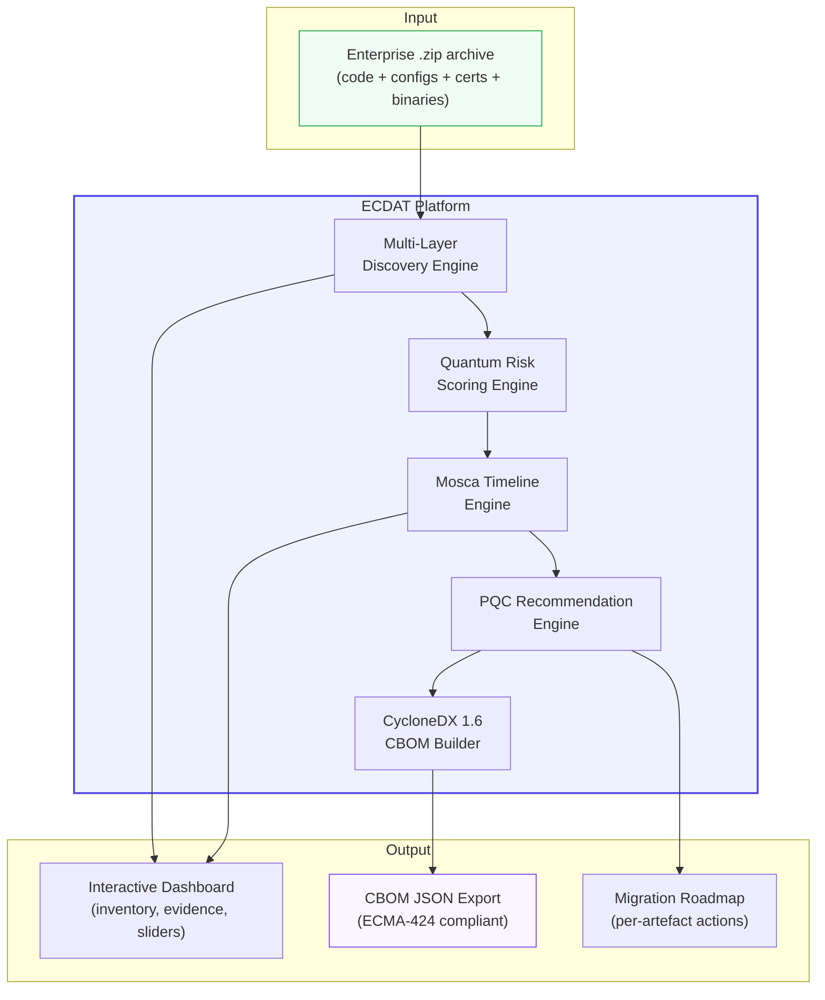
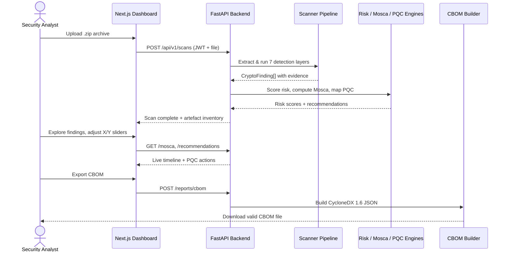
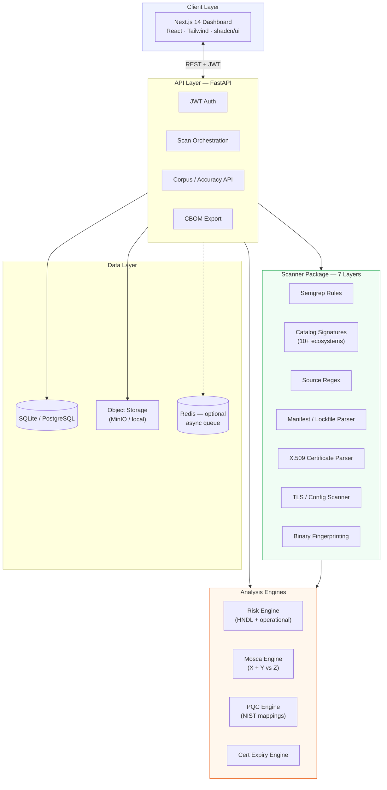
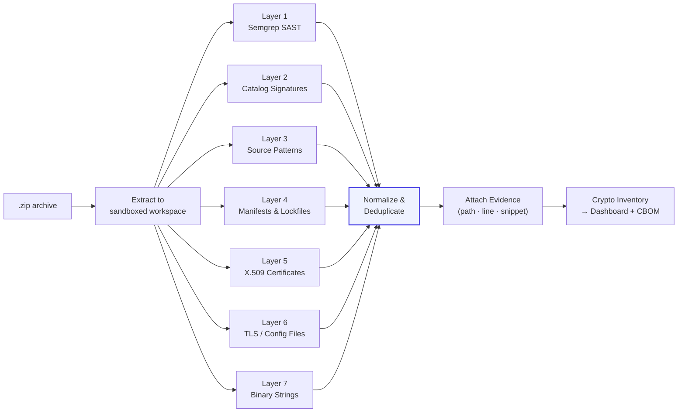
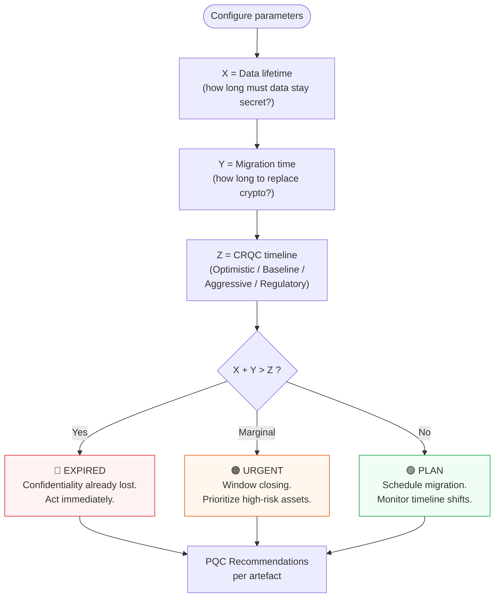
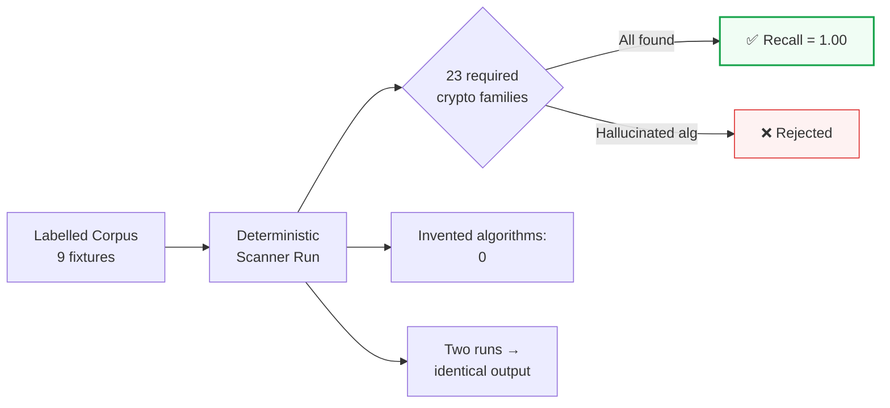
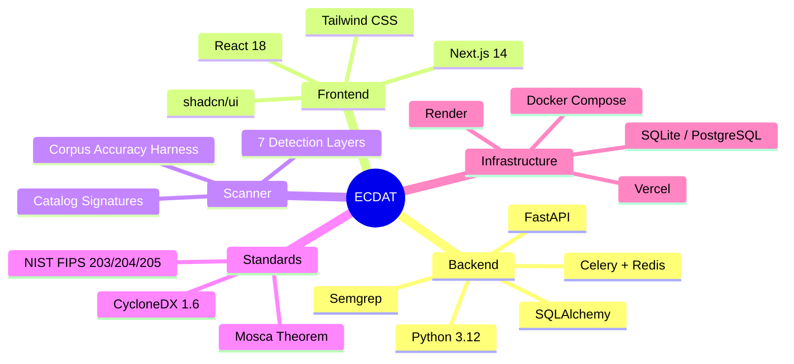
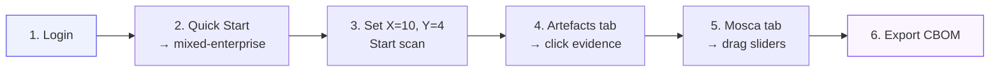

<div align="center">

# ECDAT

### Enterprise Cryptographic Discovery & Analysis Tool

**The security X-ray for enterprise cryptography — discover, score, timeline, recommend, and export.**

<br/>

[](https://sih.gov.in/)
[](https://sih.gov.in/)
[](https://ntro.gov.in/)
[](https://cyclonedx.org/)
[](https://csrc.nist.gov/projects/post-quantum-cryptography)
[](LICENSE)

<br/>

**Team Mavericks** · SIH 2026 · Theme: *Blockchain & Cybersecurity*

[Live Demo](https://ecdat-zeta.vercel.app) · [API Docs](https://ecdat-api-iqgx.onrender.com/docs) · [Architecture](docs/ARCHITECTURE.md) · [Judge Q&A](docs/WINNING_GUIDE.md)

</div>

---

## Table of Contents

- [Executive Summary](#executive-summary)
- [The Problem NTRO Faces](#the-problem-ntro-faces)
- [Our Solution](#our-solution)
- [End-to-End Flow](#end-to-end-flow)
- [System Architecture](#system-architecture)
- [Discovery Pipeline](#discovery-pipeline)
- [Mosca Timeline Engine](#mosca-timeline-engine)
- [Live Demo](#live-demo)
- [Problem Statement Traceability](#problem-statement-traceability)
- [Proof of Quality](#proof-of-quality)
- [Key Capabilities](#key-capabilities)
- [Technology Stack](#technology-stack)
- [Quick Start](#quick-start)
- [5-Minute Judge Demo](#5-minute-judge-demo)
- [API Reference](#api-reference)
- [Project Structure](#project-structure)
- [Testing & Validation](#testing--validation)
- [Deployment](#deployment)
- [Standards & Frameworks](#standards--frameworks)
- [Documentation Hub](#documentation-hub)
- [Team](#team)
- [License](#license)

---

## Executive Summary

> **You cannot migrate what you cannot see.**

**ECDAT** is a full-stack **Cryptographic Bill of Materials (CBOM)** platform built for **Smart India Hackathon 2026**, Problem Statement **26164**, issued by the **National Technical Research Organisation (NTRO)**.

Upload a `.zip` archive of any enterprise codebase — Java, Python, Node, Go, Spring, nginx configs, certificates, binaries — and ECDAT will:

| Step | What happens |
|:----:|--------------|
| **1** | **Discover** every cryptographic artefact with file-level evidence (path, line, snippet) |
| **2** | **Score** quantum vulnerability (0–10) combining HNDL threat and operational weakness |
| **3** | **Timeline** migration urgency using **Mosca's theorem** — interactive \(X + Y > Z\) analysis |
| **4** | **Recommend** NIST-standard PQC replacements (ML-KEM, ML-DSA, SLH-DSA) and hybrid pairings |
| **5** | **Export** a standards-compliant **CycloneDX 1.6+ CBOM** (ECMA-424 cryptographic-asset schema) |

Unlike inventory-only tools, ECDAT closes the full loop from **zip upload → evidence-backed findings → quantum risk → PQC roadmap → CBOM export** — deployable **on-premise** where classified and air-gapped workloads actually run.

---

## The Problem NTRO Faces



### Why this matters

| Threat | Impact |
|--------|--------|
| **Shor's algorithm** | Breaks RSA, ECDH, ECDSA, DSA — polynomial time on a CRQC |
| **Harvest Now, Decrypt Later** | Adversaries store ciphertext today; long-lived government data is already at risk |
| **Invisible cryptography** | Crypto hides in lockfiles, headless PEMs, `.p12` keystores, nginx configs, and native `.so` libraries |
| **No CBOM** | Without inventory, PQC migration is guesswork — compliance fails, risk compounds |

NTRO's problem statement demands an automated platform that finds cryptography across **source, dependencies, certificates, configs, and binaries**, assesses **quantum risk**, applies **Mosca's theorem**, recommends **PQC alternatives**, and exports a **standardized CBOM** — with an **interactive GUI**.

**ECDAT delivers every requirement.**

---

## Our Solution



### What makes ECDAT different

| Capability | Typical inventory tools | ECDAT |
|------------|------------------------|-------|
| Discovery depth | Source code only | **7 detection layers** — Semgrep, catalog, manifests, certs, configs, binaries |
| Evidence | Algorithm name only | **File path + line number + code snippet** for every finding |
| Quantum risk | None or generic | **Composite 0–10 score** with HNDL + operational factors |
| Migration planning | Static report | **Interactive Mosca sliders** with 4 CRQC timeline scenarios |
| PQC guidance | Generic advice | **NIST FIPS 203/204/205** mappings + hybrid pairings (e.g. X25519+ML-KEM-768) |
| Output format | Custom JSON | **CycloneDX 1.6+ CBOM** — industry standard, tool-integrable |
| Deployment | Cloud SaaS | **On-prem / Docker / air-gap ready** — no mandatory cloud |
| Accuracy | Unverifiable | **Published corpus scoreboard** — 23/23 checks, 0 invented algorithms |

---

## End-to-End Flow



---

## System Architecture



---

## Discovery Pipeline

Every uploaded archive passes through **seven deterministic detection layers**. Findings are deduplicated, ranked by detection method confidence, and enriched with evidence.



### What the catalog layer covers

| Category | Coverage |
|----------|----------|
| **Languages** | Java/Kotlin JCA-JCE, Python, Node/Web Crypto, Go, C/OpenSSL, .NET, PHP, Ruby, Rust |
| **Package ecosystems** | npm, PyPI, Maven, Go modules, Cargo, Gemfile, Composer — **including lockfiles** |
| **Certificates & keys** | Headless PEMs (`fullchain`, no extension), `.p12`/`.pfx`/`.jks` keystores, `id_rsa` |
| **Configs** | nginx, Spring `application.yml`, Docker Compose, `.env`, Terraform |
| **Binaries** | `.so`, `.dll`, `.class`, `.wasm` + magic-byte sniffing for extensionless files |
| **Cloud KMS** | AWS KMS, GCP KMS, Azure Key Vault, HashiCorp Vault SDK references |

---

## Mosca Timeline Engine

**Mosca's theorem:** if the sum of data confidentiality lifetime **\(X\)** and migration time **\(Y\)** exceeds the arrival of a CRQC **\(Z\)**, your data is already at risk today.



The dashboard exposes **live sliders** for \(X\) and \(Y\), instantly updating urgency across all artefacts — no re-scan required.

---

## Live Demo

<div align="center">

| | URL |
|---|-----|
| **Dashboard (primary)** | [**ecdat-zeta.vercel.app**](https://ecdat-zeta.vercel.app) |
| **API + Swagger** | [**ecdat-api-iqgx.onrender.com/docs**](https://ecdat-api-iqgx.onrender.com/docs) |
| **Health check** | [ecdat-api-iqgx.onrender.com/health](https://ecdat-api-iqgx.onrender.com/health) |

</div>

```
Login:  admin@example.com
Password: admin123
```

> **Note:** Free-tier Render services spin down after ~15 minutes of inactivity. The first API request after idle may take **30–60 seconds** — the login page shows live API status while the backend wakes up.

### Quick start demos (built-in)

From the dashboard **Quick start** section, each tile loads a different bundled corpus archive:

| Demo Archive | What it demonstrates |
|--------------|---------------------|
| `mixed-enterprise.zip` | Java RSA/ECB, nginx TLS 1.0, expiring cert, native `libcrypto_legacy.so` |
| `java-rsa-aes.zip` | Classic JCA `RSA/ECB` patterns in Java source |
| `python-crypto.zip` | `hashlib`, legacy Python crypto APIs |
| `weak-configs.zip` | TLS and nginx configuration weaknesses |

---

## Problem Statement Traceability

Every NTRO requirement maps to a shipped capability:

| Req ID | NTRO Requirement | ECDAT Delivery | Status |
|--------|------------------|----------------|--------|
| **Req-1** | Discover crypto artefacts across source, libraries, binaries, containers, configs | 7-layer scanner: Semgrep + catalog + manifests + certs + configs + binaries | ✅ |
| **Req-2** | Comprehensive quantum risk assessment | Composite 0–10 risk engine (HNDL + operational weakness) | ✅ |
| **Req-3** | Classify by type, lifetime, criticality; apply Mosca's theorem | Artefact taxonomy + interactive \(X + Y > Z\) with 4 CRQC scenarios | ✅ |
| **Req-4** | Recommend PQC / hybrid alternatives | NIST FIPS 203/204/205 mappings + hybrid pairings per artefact | ✅ |
| **Deliv-1** | Standalone discovery tool, multiple target types | FastAPI scanner with `.zip` upload, Docker + on-prem deploy | ✅ |
| **Deliv-2** | Standardized CBOM report export | CycloneDX 1.6+ JSON (ECMA-424 `cryptographic-asset`) | ✅ |
| **Deliv-3** | Interactive GUI for exploration | Next.js dashboard: inventory, evidence drawer, Mosca sliders, CBOM export | ✅ |

---

## Proof of Quality

We do not ask judges to trust us — we **measure** accuracy on a labelled corpus.



| Metric | Result |
|--------|--------|
| **Recall** (labelled crypto families) | **23 / 23** across 9 fixtures |
| **Invented algorithms** | **0** (no hallucinated GOST, Camellia, etc.) |
| **Determinism** | Two consecutive runs → identical finding keys |
| **Unlabelled repo test** | `realistic-stack` fixture → **15+ findings**, 4+ detection methods, zero invented algs |
| **API endpoint** | `GET /api/v1/accuracy` — live scoreboard |

```bash
# Reproduce locally
PYTHONPATH=backend:. python -m scanner.accuracy.measure
curl -s http://localhost:8000/api/v1/accuracy
```

Full methodology: [`docs/ACCURACY.md`](docs/ACCURACY.md)

---

## Key Capabilities

<details>
<summary><strong>🔍 Discovery — find crypto everywhere it hides</strong></summary>

- Static analysis via **Semgrep** custom crypto rules
- **Catalog signatures** across 10+ language ecosystems and 40+ package names
- **Lockfile parsing** — not just `package.json`, but `package-lock.json`, `poetry.lock`, `go.sum`, `Cargo.lock`
- **Certificate parsing** — X.509 with subject, issuer, expiry; headless PEMs without file extensions
- **Config scanning** — nginx, Spring YAML, Docker Compose, `.env`, Terraform
- **Binary fingerprinting** — ELF/PE magic bytes, OpenSSL strings in `.so`/`.dll`

</details>

<details>
<summary><strong>⚡ Risk — score what matters</strong></summary>

- **Quantum vulnerability** scoring (Shor-vulnerable vs Grover-affected vs safe)
- **HNDL exposure** — long data lifetime amplifies harvest-now-decrypt-later risk
- **Operational weakness** — weak TLS versions, expired certs, deprecated algorithms (MD5, SHA-1, RSA-1024)
- **Per-artefact risk badge** — Critical / High / Medium / Low with explainable factors

</details>

<details>
<summary><strong>⏳ Mosca — timeline migration urgency</strong></summary>

- User-configurable **X** (data lifetime) and **Y** (migration time)
- Four **Z** scenarios: Optimistic, Baseline, Aggressive, Regulatory
- Live urgency categories: **EXPIRED → URGENT → PLAN**
- Sliders update instantly without re-scanning

</details>

<details>
<summary><strong>🛡️ PQC — actionable migration guidance</strong></summary>

- Maps legacy algorithms to **ML-KEM-768**, **ML-DSA-65**, **SLH-DSA**
- Hybrid recommendations: e.g. `RSA-2048` → `ML-KEM-768 + X25519MLKEM768`
- Per-artefact action items with NIST standard references
- Aligned with **NIST IR 8547** transition timeline

</details>

<details>
<summary><strong>📋 CBOM — standards-native export</strong></summary>

- **CycloneDX 1.6+** JSON with `cryptographic-asset` components (ECMA-424)
- Includes algorithm, key size, location, risk score, PQC recommendation
- Validated against bundled JSON schema
- Integrates with existing SBOM/CBOM tooling chains

</details>

---

## Technology Stack



| Layer | Technologies |
|-------|-------------|
| **API** | Python 3.12 · FastAPI · SQLAlchemy · Pydantic · JWT |
| **Scanner** | Semgrep · Custom catalog signatures · X.509 parser · Binary sniffing |
| **Engines** | Risk scoring · Mosca timeline · PQC mapping · Cert expiry |
| **CBOM** | CycloneDX 1.6 builder + JSON schema validator |
| **Frontend** | Next.js 14 · TypeScript · Tailwind CSS · shadcn/ui |
| **Infra** | Docker Compose · Render · Vercel · SQLite/PostgreSQL · MinIO · Redis (optional) |

---

## Quick Start

### Prerequisites

- **Docker** (recommended) **or** Python 3.12+ and Node.js 20+
- Git

### Option A — Docker Compose (full stack)

```bash
git clone https://github.com/LakshAgrawal28/SIH26184_Mavericks.git
cd SIH26184_Mavericks
cp .env.example .env
docker compose up -d --build
```

| Service | URL |
|---------|-----|
| Frontend | http://localhost:3000 |
| API / Swagger | http://localhost:8000/docs |
| MinIO console | http://localhost:9001 |

### Option B — Local development

**Terminal 1 — API:**

```bash
export PYTHONPATH="$(pwd)"
export DATABASE_URL=sqlite:///./ecdat_dev.db
export SYNC_SCAN=true
export JWT_SECRET=dev-secret

cd backend
python3 -m venv .venv && source .venv/bin/activate
pip install -r requirements.txt
uvicorn app.main:app --reload --host 0.0.0.0 --port 8000
```

Or: `bash scripts/dev-api.sh`

**Terminal 2 — Frontend:**

```bash
cd frontend
cp .env.example .env.local
npm install && npm run dev
```

Open **http://localhost:3000** · Login: `admin@example.com` / `admin123`

---

## 5-Minute Judge Demo



| Step | Action | What to highlight |
|:----:|--------|-------------------|
| **1** | Sign in at [ecdat-zeta.vercel.app](https://ecdat-zeta.vercel.app) | API health indicator on login page |
| **2** | Dashboard → Quick start → **mixed-enterprise.zip** | Pre-loaded demo archive, distinct corpus per tile |
| **3** | Set **X = 10 years**, **Y = 4 years** → Start scan | Mosca panel shows baseline \(Z = 10\) → **At Risk** |
| **4** | Open scan → **Artefacts** tab → click a row | File path, line number, code snippet evidence |
| **5** | **Mosca** tab → drag sliders | Urgency flips between EXPIRED / URGENT / PLAN live |
| **6** | **Export CBOM** | Valid CycloneDX 1.6 JSON downloads |

**Judge-proof line:** *"Point ECDAT at a zip. It finds every algorithm, key, certificate, and library it can prove, computes quantum vulnerability and Mosca timelines, and tells you the exact NIST PQC replacement — with a standards-compliant CBOM export."*

Presentation script: [`docs/PRESENTATION_SCRIPT.md`](docs/PRESENTATION_SCRIPT.md)

---

## API Reference

| Endpoint | Method | Description |
|----------|--------|-------------|
| `/api/v1/auth/login` | POST | JWT authentication |
| `/api/v1/scans` | GET / POST | List scans / upload archive |
| `/api/v1/scans/{id}` | GET | Scan status and progress |
| `/api/v1/scans/{id}/artefacts` | GET | Discovered crypto inventory |
| `/api/v1/scans/{id}/mosca` | GET | Mosca timeline (live X/Y params) |
| `/api/v1/scans/{id}/recommendations` | GET | PQC / hybrid migration actions |
| `/api/v1/scans/{id}/reports/cbom` | POST | Download CycloneDX CBOM JSON |
| `/api/v1/corpus/{filename}` | GET | Bundled demo archives for Quick start |
| `/api/v1/accuracy` | GET | Corpus accuracy scoreboard |
| `/health` | GET | API + database health check |

Interactive docs: **https://ecdat-api-iqgx.onrender.com/docs**

Full specification: [`docs/API_SPEC.md`](docs/API_SPEC.md)

---

## Project Structure

```
SIH26184_Mavericks/
├── backend/                     # FastAPI application
│   ├── app/
│   │   ├── api/v1/              # REST endpoints (auth, scans, reports, meta)
│   │   ├── engines/             # Risk, Mosca, PQC, cert expiry engines
│   │   ├── cbom/                # CycloneDX 1.6 builder + validator
│   │   ├── services/            # Scan pipeline orchestration
│   │   └── corpus_bootstrap.py  # Auto-build demo archives on startup
│   └── tests/                   # pytest suite + E2E moat tests
├── frontend/                    # Next.js 14 dashboard
│   └── src/
│       ├── app/(main)/          # Dashboard, scans, artefacts, settings
│       ├── components/          # AppShell, MoscaRiskPanel, StatCard, …
│       └── lib/                   # API client, corpus demos, navigation
├── scanner/                     # Standalone discovery engine
│   ├── detectors/               # 7 detection layers + pipeline
│   ├── catalog/                 # Cross-language signature catalog
│   ├── rules/                   # Semgrep YAML rules
│   ├── corpus/                  # Labelled fixtures + demo archives
│   └── accuracy/                # Deterministic accuracy harness
├── docs/                        # Architecture, API, SIH guides, team briefs
├── infra/docker/                # Dockerfiles (API, worker, frontend)
├── scripts/                     # dev-api.sh helper
├── docker-compose.yml
└── render.yaml                  # Render Blueprint
```

---

## Testing & Validation

```bash
# Backend tests
cd backend && pip install -r requirements.txt && pytest tests -q

# Frontend build check
cd frontend && npm install && npm run build

# Corpus accuracy scoreboard
PYTHONPATH=backend:. python -m scanner.accuracy.measure
```

| Test suite | What it proves |
|------------|----------------|
| `test_scan_pipeline.py` | End-to-end scan produces artefacts |
| `test_moat.py` | Unlabelled multi-language repo is not empty |
| `test_realistic_stack_e2e.py` | Full API path for random zip upload |
| `test_engines.py` | Risk, Mosca, PQC engine correctness |
| Corpus harness | 23/23 recall, 0 invented, deterministic |

---

## Deployment

### Render (API)

```yaml
# render.yaml — Blueprint included in repo
ecdat-api:     Python/FastAPI, sync-scan, SQLite
ecdat-frontend: Next.js on Render (legacy)
```

```bash
render blueprints validate render.yaml
```

### Vercel (primary frontend)

```bash
cd frontend
vercel deploy --prod
# NEXT_PUBLIC_API_URL=https://ecdat-api-iqgx.onrender.com
```

| Environment | Frontend | API |
|-------------|----------|-----|
| **Production** | [ecdat-zeta.vercel.app](https://ecdat-zeta.vercel.app) | [ecdat-api-iqgx.onrender.com](https://ecdat-api-iqgx.onrender.com) |

---

## Standards & Frameworks

| Standard | Role in ECDAT |
|----------|---------------|
| [CycloneDX 1.6 / ECMA-424](https://cyclonedx.org/) | CBOM output format (`cryptographic-asset` components) |
| [NIST FIPS 203](https://csrc.nist.gov/pubs/fips/203/final) | ML-KEM (Kyber) key encapsulation |
| [NIST FIPS 204](https://csrc.nist.gov/pubs/fips/204/final) | ML-DSA (Dilithium) digital signatures |
| [NIST FIPS 205](https://csrc.nist.gov/pubs/fips/205/final) | SLH-DSA (SPHINCS+) hash-based signatures |
| [NIST IR 8547](https://csrc.nist.gov/pubs/ir/8547/ipd) | PQC transition timeline guidance |
| [NIST SP 1800-38B](https://www.nccoe.nist.gov/projects/migration-post-quantum-cryptography) | Cryptographic discovery architecture reference |
| **Mosca's theorem** | \(X + Y > Z\) migration urgency model |

---

## Documentation Hub

| Document | Purpose |
|----------|---------|
| [`docs/ARCHITECTURE.md`](docs/ARCHITECTURE.md) | System design, data flow, component diagram |
| [`docs/PRD.md`](docs/PRD.md) | Full product requirements document |
| [`docs/API_SPEC.md`](docs/API_SPEC.md) | REST API reference |
| [`docs/CBOM_SPEC.md`](docs/CBOM_SPEC.md) | CycloneDX field mapping |
| [`docs/ACCURACY.md`](docs/ACCURACY.md) | Corpus accuracy methodology |
| [`docs/CONTEXT.md`](docs/CONTEXT.md) | Domain theory, quantum threat model, NTRO positioning |
| [`docs/WINNING_GUIDE.md`](docs/WINNING_GUIDE.md) | SIH judging prep, anticipated Q&A |
| [`docs/PRESENTATION_SCRIPT.md`](docs/PRESENTATION_SCRIPT.md) | 4-minute pitch script |
| [`docs/CRYPTO_CHEAT_SHEET.md`](docs/CRYPTO_CHEAT_SHEET.md) | Quick reference for team |
| [`docs/team-briefs/00-INDEX.md`](docs/team-briefs/00-INDEX.md) | Per-member reading briefs |

---

## Team

<div align="center">

### Team Mavericks

**Smart India Hackathon 2026**

| | |
|---|---|
| **Problem Statement** | 26164 — Enterprise Cryptographic Discovery & Analysis Tool |
| **Organization** | National Technical Research Organisation (NTRO) |
| **Theme** | Blockchain & Cybersecurity |
| **Repository** | [github.com/LakshAgrawal28/SIH26184_Mavericks](https://github.com/LakshAgrawal28/SIH26184_Mavericks) |

<br/>

*"ECDAT is standards-native, measurable, and deployable where NTRO actually works — on premise, with evidence, not vibes."*

</div>

---

## License

This project is licensed under the [MIT License](LICENSE).

---

<div align="center">

**Built with precision for SIH 2026 · Problem Statement 26164 · NTRO**

[⬆ Back to top](#ecdat)

</div>
